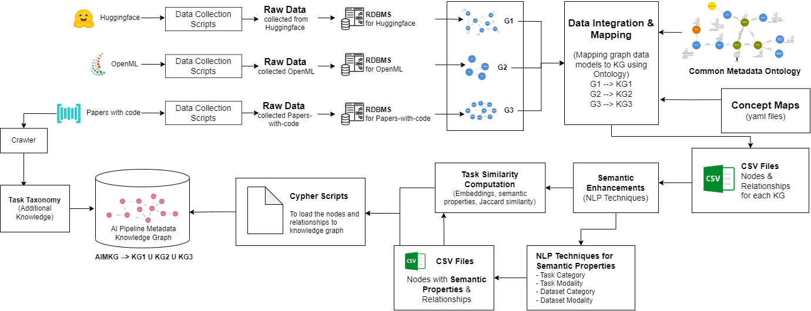

# AI Metadata Knowledge Graph
AI Metadata Knowledge Graph (AI-MKG) is constructed by integrating and aggregating pipeline metadata from various sources such as Papers-with-code, OpenML and Huggingface using Common Metadata Ontology (CMO). The system architecture for AI-MKG can be found below.

### Data Sources
##### Papers-with-code
Papers-with-Code provides extensive metadata for research papers and associated code repositories, encompassing over 1 million entries. The metadata covers various components and stages of AI pipelines described in the papers. Through their API, Papers-with-Code offers metadata including PDF URLs, GitHub repository links, task details, dataset information, methods employed, and evaluation metrics/results. While not all stages of metadata are available for every paper through the API, the information can still be obtained by referring to the research papers and their code repositories.

##### OpenML
OpenML provides metadata on machine learning pipelines logged by users, offering detailed information on tasks, datasets, flows, runs with parameter settings, and evaluations. OpenML encompasses eight major task types executed on various datasets, resulting in 1,600 unique tasks. For each task, most recent 500 runs have been collected which amounts to a total of 330,000 runs. 

##### Huggingface
Huggingface is a model hub that offers users access to numerous pretrained models. It covers a wide range of tasks, including computer vision, natural language processing, tabular data, reinforcement learning, and multimodal learning. Huggingface provides model-centric information, along with datasets and evaluations, enabling the construction of complete pipelines. Currently, approximately 50,000 pipelines have been collected from Huggingface. 

## Common Metadata Ontology
As the data from various sources follow different nomenclature and data structure, we propose Common Metadata Ontology(CMO) to unify them. The overview of CMO can be found below and the details can be found at [common-metadata-ontology](common-metadata-ontology/readme.md) folder

## Mapping
The details of mapping of each sources to Common Metadata Ontology can be found in [kg-alignment](kg-alignment/readme.md) folder.

## Sample Queries
The sample queries performed on AI-MKG can be found at [sample_queries](sample_queries/readme.md)

