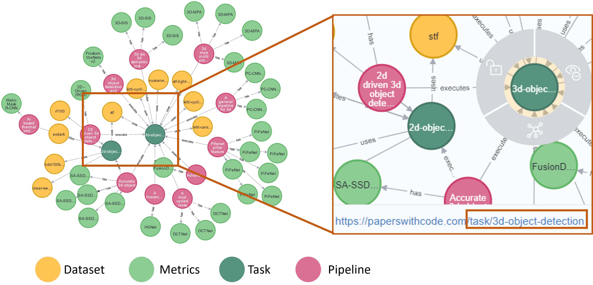

# AI Pipeline Recommender
The rapid growth of Artificial Intelligence (AI) has led to the development of many open-source datasets and machine learning models trained for various tasks. However, to effectively retrain or fine-tune these models, it is necessary to study the entire pipeline lineage, which includes dataset selection, dataset preprocessing, model selection, hyperparameter tuning, tasks, evaluation methods, and metrics. The interactions of these pipeline components are often not readily available, making it challenging to reproduce experiments or learn from them in this rapidly evolving field. We propose and showcase demonstration of an explainable AI pipeline recommender that recommends relevant end-to-end pipeline lineage graphs based on descriptions of pipelines or its components (tasks, datasets, or models). The leading contributions of this demo are (i) Dynamic AI Pipeline Constructor to gather pipeline metadata from open sources to assemble 1.6 million end-to-end pipeline lineages; (ii) A novel custom heuristic ranking function to recommend pipelines given unseen tasks, datasets, models, or pipeline description; and (iii) Presenting user-level explanations, code repositories and pipeline documentations to enable explainability, reproducibility and traceability to pipeline source. User study on evaluation of recommendation relevance showed that proposed custom heuristic achieved 78\% accuracy and embedding similarity achieved 51\%. 

### Data Sources
##### Papers-with-code
Papers-with-Code provides extensive metadata for research papers and associated code repositories, encompassing over 1 million entries. The metadata covers various components and stages of AI pipelines described in the papers. Through their API, Papers-with-Code offers metadata including PDF URLs, GitHub repository links, task details, dataset information, methods employed, and evaluation metrics/results. While not all stages of metadata are available for every paper through the API, the information can still be obtained by referring to the research papers and their code repositories.

##### OpenML
OpenML provides metadata on machine learning pipelines logged by users, offering detailed information on tasks, datasets, flows, runs with parameter settings, and evaluations. OpenML encompasses eight major task types executed on various datasets, resulting in 1,600 unique tasks. For each task, most recent 500 runs have been collected which amounts to a total of 330,000 runs. 

##### Huggingface
Huggingface is a model hub that offers users access to numerous pretrained models. It covers a wide range of tasks, including computer vision, natural language processing, tabular data, reinforcement learning, and multimodal learning. Huggingface provides model-centric information, along with datasets and evaluations, enabling the construction of complete pipelines. Currently, approximately 50,000 pipelines have been collected from Huggingface. 

## Common Metadata Ontology
As the data from various sources follow different nomenclature and data structure, we propose Common Metadata Ontology(CMO) to unify them. The overview of CMO can be found below and the details can be found at [common-metadata-ontology](common-metadata-ontology/readme.md) folder

## Mapping
The details of mapping of each sources to Common Metadata Ontology can be found in [kg-alignment](kg-alignment/readme.md) folder.

## Sample Queries
Sample Query: List all the image detection pipelineswith dataset and evaluations. 

On querying the graph to return all the pipelines executed for image based detection task, the above mentioned result was obtained. The figure consists of two task node - (i) 2d object detection (ii) 3d object detection. AI-MKG has the capabilities to identify that these two are image detection based tasks even though the names have no explicit mention of ’image’.

More sample queries performed on AI-MKG can be found at [sample_queries](sample_queries/readme.md)

