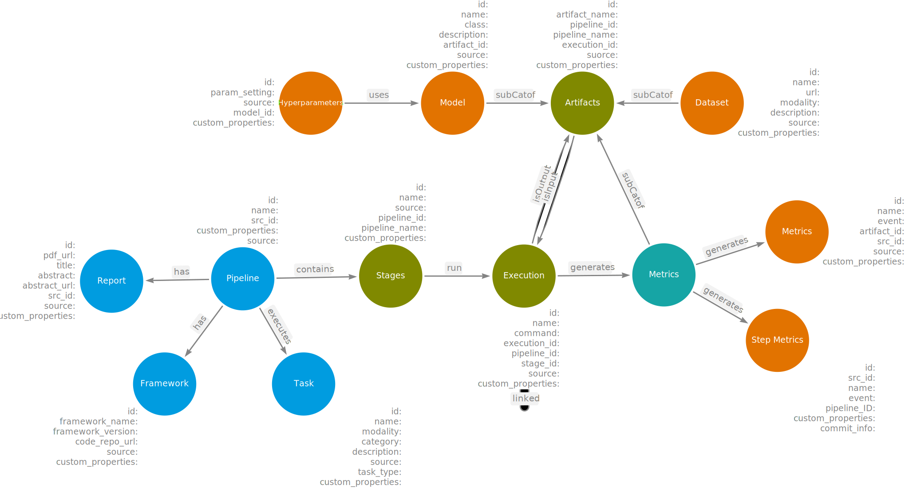

## Common Metadata Ontology
Common Metadata Ontology(CMO), formalization of AI-MKG, was proposed to integrate and aggregate the pipeline metadata from various sources such as Papers-with-code, OpenML and Huggingface. The overview of CMO can be found below.

### Sample pipeline represented using CMO

The sample figure shows a pipeline titled "Robust outlier detection by de-biasing VAE likelihoods" executed for "Outlier Detection" task for the stage train/test. The model used in the pipeline was "Variational Autoencoder". Several datasets were used in the pipeline implementation which are as follows (i) German Traffic Sign, (ii) Street View House Numbers and (iii) CelebFaces Arrtibutes dataset. The corresponding hyperparameters used and the metrics generated as a result of execution are included in the figure. The external link to source figure created using arrows.app can be found [here](https://drive.google.com/file/d/1oa3tKMKZlmDFI0sBcIkWZdW4LS4P6WMs/view?usp=sharing)

The properties of each node can be found below.

##### Pipeline
* pipeline_id
* pipeline_name
* pipeline_source
* source_id
* custom_properties*

##### Report
* report_id
* report_title
* report_pdf_url
* source
* source_id
* abstract*
* custom_properties*

##### Task
* task_id
* task_name
* task_description
* task_type
* modality
* category
* source
* custom_properties*

##### Framework
* framework_id
* framework_name
* code_repo_url
* framework_version
* source

##### Stage
* stage_id
* stage_name
* source
* pipeline_id
* pipeline_name
* custom_properties

##### Execution
* execution_id
* execution_name
* stage_id
* stage_name
* pipeline_id
* pipeline_name
* source
* command (CLI command to run the execution)
* custom_properties

##### Artifact
* artifact_id
* artifact_name
* pipeline_id
* pipeline_name
* execution_id
* source
* custom_properties

##### Dataset
* dataset_id
* dataset_name
* dataset_url
* modality
* description
* source
* custom_properties

##### Model
* model_id
* model_name
* model_class
* description
* artifact_id
* source
* custom_properties

##### Metric
* metric_id
* metric_name
* artifact_id
* evaluations
* source
* custom_properties**

##### Hyperparameters
* parameter_id
* parameter_setting (key-value pair)
* source
* model_id
* custom_properties

NOTE: 
* *are optional properties
* There additional information on each node, different for each source. As of now, there are included in the KG for efficient search. But they are available to be used in the future to extract the data and populate as node properties.
* **For metric, there are umpteen possible metric names and values. Therefore, we capture all of them as a key value pair under evaluations
* custom_properties are where user can enter custom properties for each node while executing a pipeline
* source is the source from which the node is obtained - papers-with-code, openml, huggingface

#### Turtle Syntax
The Turtle format of formal ontology can be found [here](cmo_v2.ttl)
