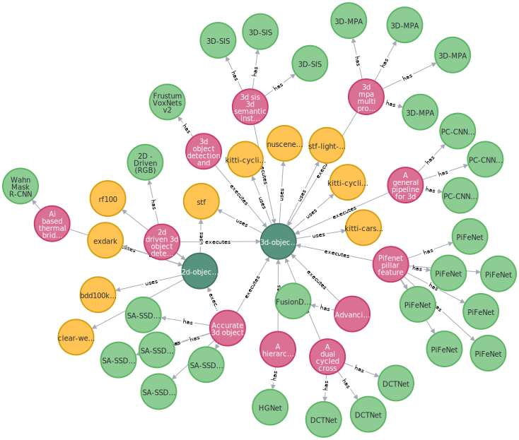
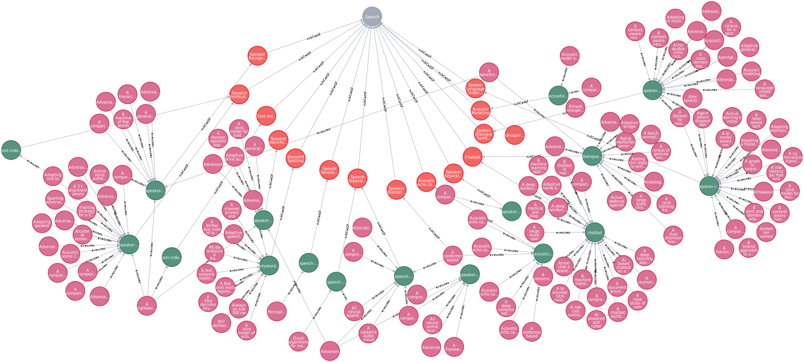
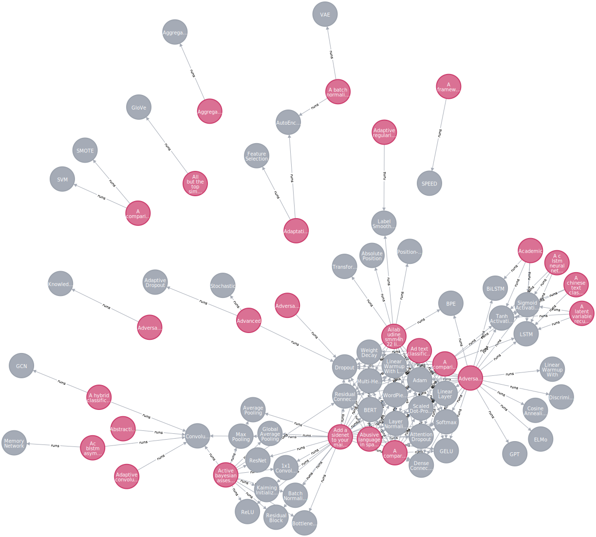
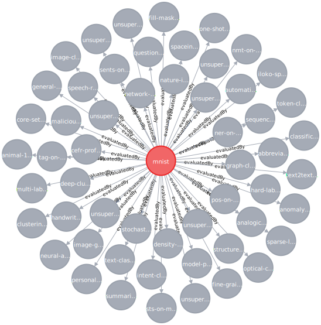
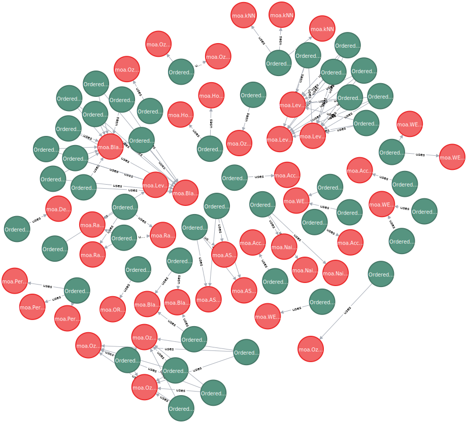

## Sample Queries
The sample queries AI-MKG is capable of performing are discussed below.

* List all the pipelines, dataset and evaluations done on iamge detection task

* List all the pipelines under Speech area

* List all the models used for text classification task

* List all the metrics performed on MNIST dataset

* Parameters used for a given model (NOTE: the parameters are present as a ordered dict)

* List the pipelines and their information executed for Outlier Detection task
