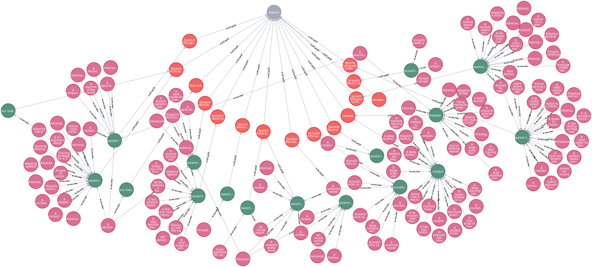
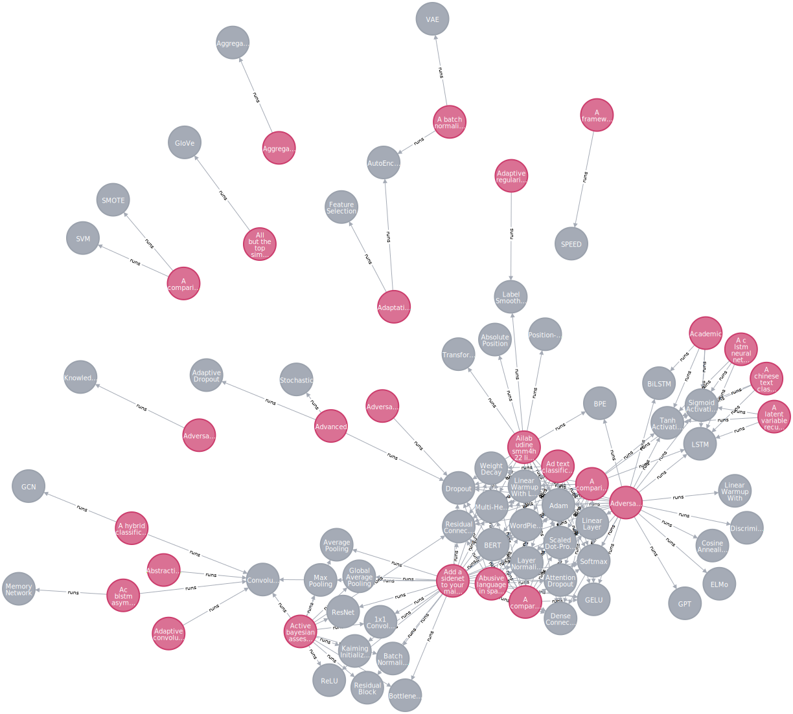
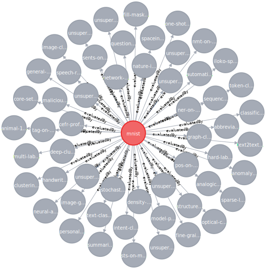

## Sample Queries
The sample queries AI-MKG is capable of performing are discussed below.

* List all the pipelines, dataset and evaluations done on iamge detection task

* List all the pipelines under Speech area

* List all the models used for text classification task

* List all the evaluations performed on MNIST dataset
